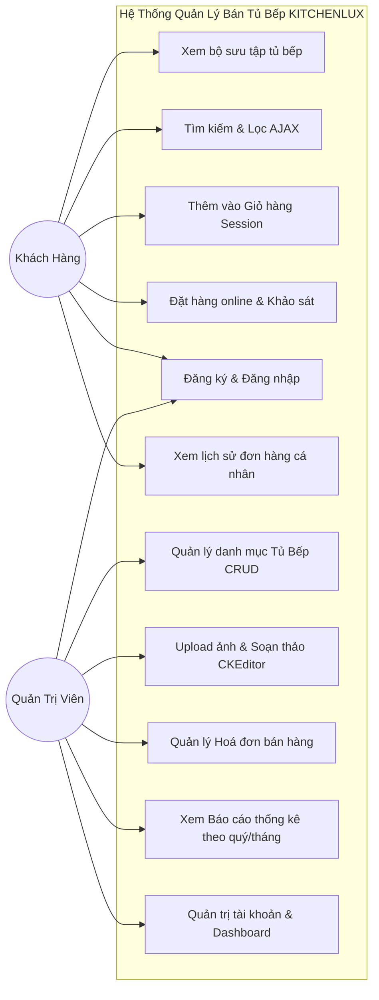

# HƯỚNG DẪN DỰ ÁN BÀI TẬP LỚN: XÂY DỰNG WEBSITE QUẢN LÝ BÁN TỦ BẾP
**Môn học:** Lập trình Web (ASP.NET Core MVC 10 + Entity Framework Core + SQL Server 2022)  
**Nhóm thực hiện:** Nhóm 5  
**Thư mục dự án:** `D:\DoStBetter\LTW\QuanLyBanTuBepWeb`

---

## 1. CÁC TÀI KHOẢN ĐĂNG NHẬP MẪU

| Loại tài khoản | Tên đăng nhập | Mật khẩu | Quyền hạn (Role) | Chức năng chính |
| :--- | :--- | :--- | :--- | :--- |
| **Quản trị viên (Admin)** | `admin` | `123456` | `Admin` | Truy cập `/Admin`: Dashboard thống kê doanh thu, Quản lý tủ bếp (CRUD + Upload ảnh + CKEditor), Quản lý hóa đơn bán, Xem 4 báo cáo thống kê theo quý/tháng. |
| **Khách hàng** | `khach01` | `123456` | `KhachHang` | Xem bộ sưu tập tủ bếp, Lọc AJAX, Thêm giỏ hàng Session, Đặt hàng online, Xem lịch sử đơn hàng cá nhân. |

---

## 2. HƯỚNG DẪN CHẠY VÀ KIỂM TRA DỰ ÁN

### Cách 1: Sử dụng Visual Studio (Khuyên dùng)
1. Mở Visual Studio -> Chọn **Open a project or solution**.
2. Tìm đến thư mục `D:\DoStBetter\LTW\QuanLyBanTuBepWeb` và chọn tệp `QuanLyBanTuBepWeb.csproj`.
3. Nhấn **F5** (hoặc nút **Play - https/http**) để chạy ứng dụng trên trình duyệt.

### Cách 2: Sử dụng dòng lệnh (Terminal / PowerShell)
```powershell
cd "D:\DoStBetter\LTW\QuanLyBanTuBepWeb"
dotnet run
```
Sau đó mở trình duyệt và truy cập: `http://localhost:5000` hoặc cổng được hiển thị trên màn hình console.

---

## 3. DANH SÁCH CÁC TÍNH NĂNG ĐÃ HIỆN THỰC THEO ĐÚNG NỘI DUNG MÔN HỌC

1. **Kiến trúc phân hệ 2 lớp người dùng (Yêu cầu 3.1 & Chương 10)**:
   - Giao diện Showroom Tủ bếp dành cho Khách hàng (`/Home`, `/Product`, `/Cart`, `/Account`).
   - Phân hệ quản trị độc lập dành cho Admin (`/Admin/Home`, `/Admin/DMHangHoa`, `/Admin/HoaDonBan`, `/Admin/BaoCao`).
2. **Bộ 3 AJAX cốt lõi (Yêu cầu 3.3 & Lab 5, Lab 6)**:
   - Lọc tủ bếp theo Chất liệu, Màu sắc, Kích thước, Xuất xứ, Khoảng giá.
   - Tìm kiếm từ khóa theo tên hoặc mã tủ bếp.
   - Phân trang động (Paging) bằng AJAX kết hợp jQuery và `PartialView("_ProductListPartial")` hoàn toàn không reload trang.
3. **Quản lý trạng thái (Session & Cookies - Yêu cầu 3.3 & Chương 7, 8)**:
   - Giỏ hàng (Shopping Cart) lưu trong Session qua `JsonSerializer` (`CartController.cs` & `SessionExtensions.cs`).
   - Đăng nhập ghi nhớ qua Cookie (`CookieAuthenticationDefaults`).
4. **Kiểm soát tính hợp lệ (Data Annotations & Validation - Lab 3)**:
   - Ràng buộc Model (`[Required]`, `[Range]`, `[RegularExpression]`, `[Compare]`).
   - Bẫy lỗi ở Client (jQuery Validate) và Server (`ModelState.IsValid`).
5. **Upload file hình ảnh & CKEditor (Yêu cầu 3.3 & Chương 10)**:
   - Upload file ảnh tủ bếp qua `IFormFile` lưu vào `wwwroot/images/products/`.
   - Tích hợp trình soạn thảo văn bản CKEditor cho trường mô tả/ghi chú sản phẩm.
6. **Web API RESTful (Yêu cầu 3.3)**:
   - Endpoint `GET /api/tubep` trả về danh sách tủ bếp định dạng JSON.
   - Endpoint `GET /api/tubep/{id}` trả về chi tiết tủ bếp theo ID.
7. **Tích hợp các Stored Procedure báo cáo đề tài**:
   - `sp_BaoCaoTop3SanPhamTheoQuy`: Top 3 sản phẩm bán chạy nhất trong quý.
   - `sp_BaoCaoTop5HDBanNhoNhatTheoQuy`: 5 hóa đơn bán hàng nhỏ nhất trong quý.
   - `sp_BaoCaoKhachHangTheoThang`: Danh sách khách hàng và doanh số theo tháng.

---

## 4. TÀI LIỆU HỖ TRỢ LÀM BÁO CÁO BÀI TẬP LỚN

### Sơ đồ Ca Sử Dụng (Use-Case Diagram) - Dùng vẽ lại trên Draw.io



### Bảng Kịch Bản Kiểm Thử Mẫu (Test Cases) - Dán vào Mục 5.4 của Báo Cáo

| ID | Chức năng test | Dữ liệu đầu vào | Kết quả kỳ vọng | Kết quả thực tế | Trạng thái |
| :--- | :--- | :--- | :--- | :--- | :--- |
| **TC01** | Lọc tủ bếp bằng AJAX | Chọn chất liệu: "Gỗ Acrylic bóng gương" | Danh sách cập nhật các tủ Acrylic, không load lại trang web | Khung danh sách cập nhật mượt mà qua PartialView | **PASS** |
| **TC02** | Phân trang AJAX | Bấm chuyển sang "Trang 2" | Hiển thị 6 sản phẩm tiếp theo, thanh URL giữ nguyên | Chuyển trang thành công bằng jQuery AJAX | **PASS** |
| **TC03** | Thêm vào giỏ hàng | Bấm nút "Chọn mua" trên sản phẩm TB01 | Badge giỏ hàng góc phải tăng thêm 1, hiện Toast thông báo | Badge nhảy từ 0 lên 1, hiện popup Toast góc dưới | **PASS** |
| **TC04** | Đặt hàng khi form trống | Để trống SĐT và bấm "Xác Nhận Đặt Hàng" | Báo lỗi validation "Số điện thoại không được để trống" | Hiện dòng chữ đỏ báo lỗi tại ô SĐT | **PASS** |
| **TC05** | Đặt hàng thành công | Nhập đầy đủ Tên, SĐT, Địa chỉ | Tạo mới HĐ bán trong DB, chuyển sang trang OrderSuccess | Sinh mã HDB thành công, giỏ hàng tự động làm trống | **PASS** |
| **TC06** | Đăng nhập Admin | Tài khoản `admin` / pass `123456` | Chuyển hướng vào trang Dashboard quản trị `/Admin` | Đăng nhập thành công, mở giao diện SB Admin | **PASS** |
| **TC07** | Thêm mới tủ bếp kèm ảnh | Nhập thông tin TB06, chọn file ảnh `.jpg` | Thêm vào CSDL, file ảnh lưu trong `wwwroot/images/products/` | Hiển thị trong bảng quản trị với ảnh vừa chọn | **PASS** |
| **TC08** | Báo cáo Top 3 theo Quý | Chọn Năm: 2026, Quý: 1 | Trả về 3 sản phẩm bán chạy nhất Quý 1/2026 theo đúng DB | Hiện chính xác 3 sản phẩm TB01, TB04, TB02 | **PASS** |
